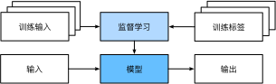
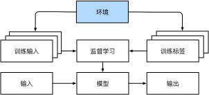

## 机器学习中的关键组件

无论什么类型的机器学习问题，都会遇到这些组件：

1. 可以用来学习的*数据*（data）；
2. 如何转换数据的*模型*（model）；
3. 一个*目标函数*（objective function），用来量化模型的有效性；
4. 调整模型参数以优化目标函数的*算法*（algorithm）。

### 1. 数据


深度学习 + 迁移学习：预训练 （pre-train）+ 微调（fine-tuen）


## 各种机器学习问题

### 监督学习

在训练参数时，我们为模型提供了一个数据集，其中每个样本都有真实的标签。


#### 回归

*回归* （regression）是最简单的监督学习任务之一。当标签取任意数值时，我们称之为*回归*问题，此时的目标是生成一个模型，使它的预测非常接近实际标签值。

#### 分类

*分类*问题希望模型能够预测样本属于哪个 *类别* （category，正式称为 *类* （class））。

我们可以试着用概率语言来理解模型。 给定一个样本特征，模型为每个可能的类分配一个概率。

#### 标记问题

有些分类问题很适合于二项分类或多项分类。学习预测不相互排斥的类别的问题称为 *多标签分类* （multi-label classification）。

#### 搜索

有时，我们不仅仅希望输出一个类别或一个实值。 在信息检索领域，我们希望对一组项目进行排序。 以网络搜索为例，目标不是简单的“查询（query）-网页（page）”分类，而是在海量搜索结果中找到用户最需要的那部分。 搜索结果的排序也十分重要，学习算法需要输出有序的元素子集。 换句话说，如果要求我们输出字母表中的前5个字母，返回“A、B、C、D、E”和“C、A、B、E、D”是不同的。 即使结果集是相同的，集内的顺序有时却很重要。

#### 推荐系统

另一类与搜索和排名相关的问题是 *推荐系统* （recommender system），它的目标是向特定用户进行“个性化”推荐。

#### 序列学习

序列学习需要摄取输入序列或预测输出序列，或两者兼而有之。 具体来说，输入和输出都是可变长度的序列，例如机器翻译和从语音中转录文本。

**标记和解析** 。这涉及到用属性注释文本序列。 换句话说，输入和输出的数量基本上是相同的。下面是一个非常简单的示例，它使用“标记”来注释一个句子，该标记指示哪些单词引用命名实体。 标记为“Ent”，是 *实体* （entity）的简写。

```text
Tom has dinner in Washington with Sally
Ent  -    -    -     Ent      -    Ent
```

**自动语音识别**。在语音识别中，输入序列是说话人的录音，输出序列是说话人所说内容的文本记录。它的挑战在于，与文本相比，音频帧多得多（声音通常以8kHz或16kHz采样）。也就是说，音频和文本之间没有1:1的对应关系，因为数千个样本可能对应于一个单独的单词。这也是“序列到序列”的学习问题，其中输出比输入短得多。


 **文本到语音** 。这与自动语音识别相反。 换句话说，输入是文本，输出是音频文件。 在这种情况下，输出比输入长得多。 虽然人类很容易识判断发音别扭的音频文件，但这对计算机来说并不是那么简单。

 **机器翻译** 。 在语音识别中，输入和输出的出现顺序基本相同。 而在机器翻译中，颠倒输入和输出的顺序非常重要。 换句话说，虽然我们仍将一个序列转换成另一个序列，但是输入和输出的数量以及相应序列的顺序大都不会相同。 比如下面这个例子，“错误的对齐”反应了德国人喜欢把动词放在句尾的特殊倾向。

```text
德语:           Haben Sie sich schon dieses grossartige Lehrwerk angeschaut?
英语:          Did you already check out this excellent tutorial?
错误的对齐:  Did you yourself already this excellent tutorial looked-at?
```

### 无监督学习

到目前为止，所有的例子都与监督学习有关，即需要向模型提供巨大数据集：每个样本包含特征和相应标签值。

相反，如果工作没有十分具体的目标，就需要“自发”地去学习了。 比如，老板可能会给我们一大堆数据，然后要求用它做一些数据科学研究，却没有对结果有要求。 这类数据中不含有“目标”的机器学习问题通常被为 *无监督学习* （unsupervised learning）。

* *聚类* （clustering）问题：没有标签的情况下，我们是否能给数据分类呢？比如，给定一组照片，我们能把它们分成风景照片、狗、婴儿、猫和山峰的照片吗？同样，给定一组用户的网页浏览记录，我们能否将具有相似行为的用户聚类呢？
* *主成分分析* （principal component analysis）问题：我们能否找到少量的参数来准确地捕捉数据的线性相关属性？比如，一个球的运动轨迹可以用球的速度、直径和质量来描述。再比如，裁缝们已经开发出了一小部分参数，这些参数相当准确地描述了人体的形状，以适应衣服的需要。另一个例子：在欧几里得空间中是否存在一种（任意结构的）对象的表示，使其符号属性能够很好地匹配?这可以用来描述实体及其关系，例如“罗马” $-$ “意大利” $+$ “法国” $=$ “巴黎”。
* *因果关系* （causality）和 *概率图模型* （probabilistic graphical models）问题：我们能否描述观察到的许多数据的根本原因？例如，如果我们有关于房价、污染、犯罪、地理位置、教育和工资的人口统计数据，我们能否简单地根据经验数据发现它们之间的关系？
* *生成对抗性网络* （generative adversarial networks）：为我们提供一种合成数据的方法，甚至像图像和音频这样复杂的非结构化数据。潜在的统计机制是检查真实和虚假数据是否相同的测试，它是无监督学习的另一个重要而令人兴奋的领域。

### 与环境互动

有人一直心存疑虑：机器学习的输入（数据）来自哪里？机器学习的输出又将去往何方？ 到目前为止，不管是监督学习还是无监督学习，我们都会预先获取大量数据，然后启动模型，不再与环境交互。 这里所有学习都是在算法与环境断开后进行的，被称为 *离线学习* （offline learning）。 对于监督学习，从环境中收集数据的过程类似于：


这种简单的离线学习有它的魅力。好的一面是，我们可以孤立地进行模式识别，而不必分心于其他问题。但缺点是，解决的问题相当有限。这时我们可能会期望人工智能不仅能够做出预测，而且能够与真实环境互动。与预测不同，“与真实环境互动”实际上会影响环境。这里的人工智能是“智能代理”，而不仅是“预测模型”。因此，我们必须考虑到它的行为可能会影响未来的观察结果。    ————**强化学习**

### 强化学习

在强化学习问题中，智能体（agent）在一系列的时间步骤上与环境交互。 在每个特定时间点，智能体从环境接收一些 *观察* （observation），并且必须选择一个 *动作* （action），然后通过某种机制（有时称为执行器）将其传输回环境，最后智能体从环境中获得 *奖励* （reward）。 此后新一轮循环开始，智能体接收后续观察，并选择后续操作，依此类推。 强化学习的过程在下图中进行了说明。 请注意，强化学习的目标是产生一个好的 *策略* （policy）。 强化学习智能体选择的“动作”受策略控制，即一个从环境观察映射到行动的功能。


当环境可被完全观察到时，强化学习问题被称为 *马尔可夫决策过程* （markov decision process）。 当状态不依赖于之前的操作时，我们称该问题为 *上下文赌博机* （contextual bandit problem）。 当没有状态，只有一组最初未知回报的可用动作时，这个问题就是经典的 *多臂赌博机* （multi-armed bandit problem）。
